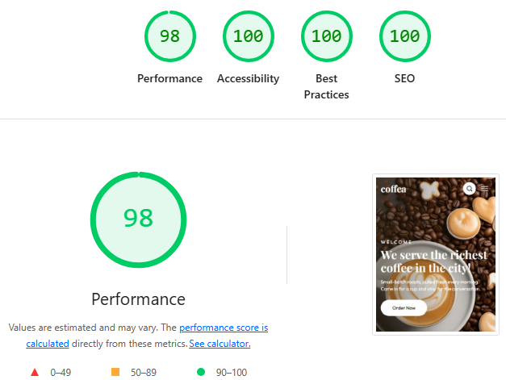

## Coffea — Landing Page ☕

Este proyecto es una landing page para la cafetería **Coffea**, desarrollada como parte del **TP4 de Diseño UX/UI** de la Licenciatura en Sistemas.

El objetivo fue maquetar la interfaz replicando el diseño de Figma usando solo **HTML5 semántico** y **CSS3** (con arquitectura modular `@layer`, tokens y BEM), sin usar nada de JavaScript ni librerías externas.

---

## 🚀 Demo en Vivo

Podés ver la página publicada online en Netlify:
👉 [coffea-landing-uriarte-iara.netlify.app](https://coffea-landing-uriarte-iara.netlify.app/)

---

## 📊 Resultados en Lighthouse (Mobile)

Auditoría realizada sobre la versión publicada en Netlify:



---

## 📂 Estructura de carpetas

```text
coffea-landing/
├── assets/
│   ├── icons/          # Íconos SVG
│   └── img/            # Imágenes del sitio (.webp)
├── css/
│   ├── components/     # Estilos de cada componente BEM
│   ├── base.css        # Reset y estilos base
│   ├── layout.css      # Estructura general (grids/flex)
│   ├── main.css        # Archivo principal con @layer
│   ├── tokens.css      # Variables de diseño
│   └── utilities.css   # Clases auxiliares
├── 404.html            # Página de error 404
├── index.html          # Estructura principal
└── README.md           # Documentación
```
